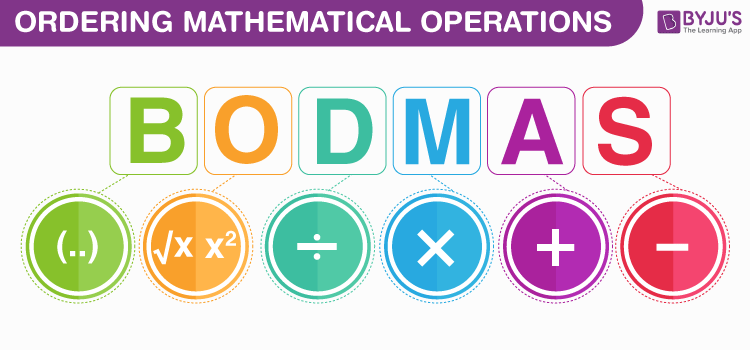
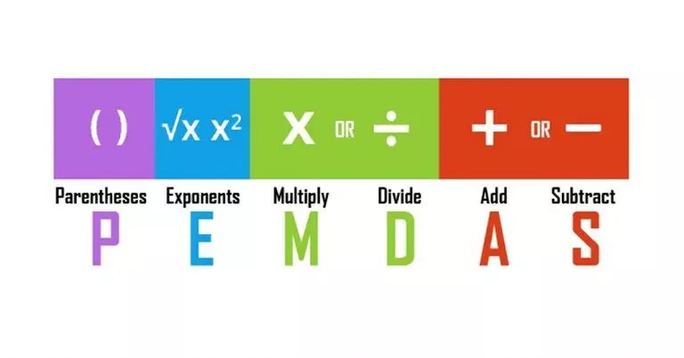
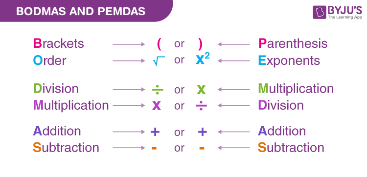
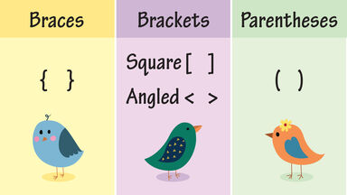
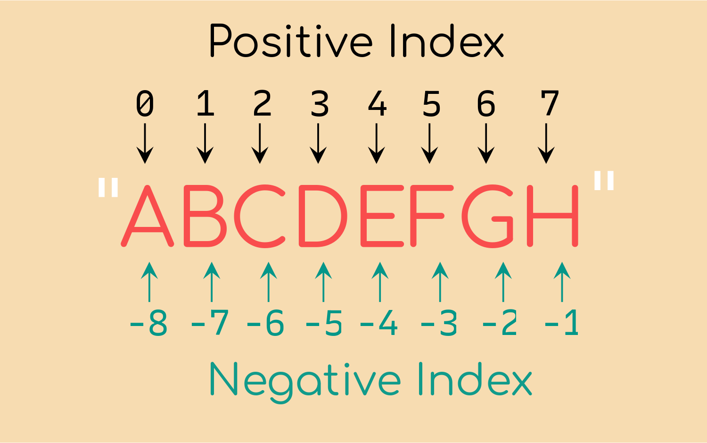

# চিহ্নের কথা
এই চাপ্টারটাতে আলোচনা করা হয়েছে : 

- What is Statement.
- What is Expression.
- Operator and their type.
- What is Operand.
- Mathematical or Arithmatic Operator.
- Assignment Operator.
- Comparision Operator.
- String Concatination.
- String Repetitiion.
- BODMAS and PEMDAS methology.
- String Character Index.
- Access String Character.

## What is Statement?
সহজ ভাষায় Statement হচ্ছে একটি নির্দেশ। ***Computer science, অনুযায়ী statement হচ্ছে এক লাইনের একটি code বা নির্দেশ যা একটি কাজ সম্পন্ন করে।*** অর্থাৎ Programming language program করার সময় আমরা comment বাদে প্রতিটা লাইন দিয়ে কম্পিউটারকে নির্দেশ দিয়। তাই Programming language comment ছাড়া বাকি সকল লাইনেই Statement। 

<br />

> In Computer programming, a statement is a single line of code that performs a spacific task.

<br />

***Example of Simple Statement nn Python :***
```python
print("Hello, World!"); # statement

vega = "I am Galaxy"; # statement.

print(vega); # statement

# comment is not statement.
```

<br />

## What is Expression?
***Computer Science অনুযায়ী, কতগুলো চিহ্ন, অক্ষর ও শব্দ মিলে যদি একটি মান বা value বা data দেয় তাহলে ঐ চিহ্ন, অক্ষর ও শব্দ গুলোকে একসাথে Expression বলে।***

<br />

> In computer science, An expression is any legal combination of symbols that represents a value.

<br />

***Example of expression :***
1. 5 + 5 + 10 * 50;
1. (40 - 10) / 40 - 50 + 10 
1. 5 + 6 + 3 + 2 + 2

***Example of expression in python :***
```python
3 * 5 + 10 - 4 % 3; # this is expression.

a = 30;
b = 50;

a + b; #  this is expression.
a * b + b + c; # this is expression.

a = "Rigel";
b = "Hello, ";
a + b; # this is expression

True and True; # this is expression because it represents value True.
```

## Operator and their kind. 
***Computer Science অনুযায়ী, operator হচ্ছে কতগুলো অক্ষর (যেমন, +, -, \*, /) ইত্যাদি যেগুলো দিয়ে কোনো কাজ বুঝায় এবং যেগুলো ব্যবহার করে নির্দিষ্টি কিছু কাজ (যেমন যোগ করা, বিয়োগ করা, ভাগ করা ইত্যাদি) করা হয়.***

<br />

> In mathematics and sometimes in computer programming, an operator is a **character that represents an action.**


### There are usually 5 types of operator in programming language by operator works.
1. Assignment Operator.
1. Mathematical or Arithematic Operator.
1. Comparision Operator.
1. Logical Operator.
1. Bitwise Operator.


### In python has extra 2 type of operator.
1. Identity Operator.
1. Membership Operator.

<br />

## What is Operand ?
***Computer science অনুযায়ী, operator যাদেরকে নিয়ে কাজ করে তাদেরকে operand বলে।***

<br />

> In computer programming, and operand is **a term used to describe any object that is capable of being mainpulated by operator.**

<br />

***For example in python :***
```python
3 + 4; # here 3 and 4 called operand.


# Equal symbol(=) is assignment operator in programming.
a = 'Sirius'; # here 'Sirius' and a is operand.
b = 'Hello'; # here 'hello' and b is operand.
a + b; # here a and b is operand.

```

## Mathematical and Arithematic Operator.
পাইথনে গানিতিক কাজে যেসকল operator ব্যবহার করা হয় তাদেরকে Mathematical operator বা Arithmatic Operator বলে। পাইথনে **৭** টা mathematical operator রয়েছে। নিচে তাদের নাম ও কাজগুলো লেখা হলো :

| Mathematical Operator | Name            | Use for                                                        |
| --------------------- | --------------- | -------------------------------------------------------------- |
| +                     | Addition        | Use for addition two number or string cancatination.           |
| -                     | Subtraction     | Use for subtract between two number.                           |
| *                     | Multiplication  | Use for multiply two number and string repetition.             |
| /                     | Division        | Use for divide a number.                                       |
| %                     | Modulus         | Use for figure out remainder after division between tow number.|
| //                    | Floor Division  | Same as division operator but it give integer number.          |
| **                    | Exponentiation  | Use for figure out number exponentiation or powered.           |


***Program : mathematical_operator.py***
```python
a = 40;
b = 10;

print(a + b); # Addition operator example
print(a - b); # subtraction operator example
print(a * b); # Multiplication operator example
print(a / b); # Division operator example

a = 40;
b = 7;
print(a % b); # modulus or remainder operator example
print(a // b); # floor division operator example
print(a ** b); # exponentiation operator example
```

***Output : mathematical_operator.py***
```bash
$python3 mathematical_operator.py 
50
30
400
4.0
5
5
163840000000
```

<br />

## Assignment Operator
**Computer programming অনুযায়ী, যে সকল operator মেমোরিতে বা variable এর মাঝে ডাটা বা মান বা value store করতে কাজে লাগে তাদেরকে Assignment operator বলে।**

<br />

> In computer science, Assignment operator are used to assign values to variables. 

<br />

***নিচে পাইথনে সকল assignment operator উদাহরন সহকারে দেওয়া হলো :***
| Assignment Operator | Example                                                         |
|---------------------|-----------------------------------------------------------------|
| =                   | n = a; # a assign to n variable                                 |
| +=                  | n += a; # n = n + a                                             |
| -=                  | n -= a; # n = n - a                                             |
| *=                  | n *= a; # n = n * a                                             |
| /=                  | n /= a; # n = n / a                                             |
| //=                 | n //= a; # n = n // a                                           |
| %=                  | n %= a; # n = n % a                                             |
| **=                 | n **= a; # n = n ** a                                           |


***Program : assignment_operator.py***
```python
a = 30;
print(a); # 30 

a += 2;
print(a); # 32 

a -= 2;
print(a); # 30

a *= 2;
print(a); # 60

a /= 2;
print(a); # 30

a %= 9;
print(a); # 3

a //= 1;
print(a); # 1

a **= 2;
print(a); # 9
```

***Output : assignment_operator.py***
```bash
$python assignment_operator.py 
30
32
30
60
30
3
3
9
```

<br />

## Comparison Operator or Ralational Operator.
Computer programming অনুযায়ী, **যে operator ব্যবহার করা হয় দুইটি value বা মান বা data এর মাঝে compare করে বা তুলনা করে দেখার জন্য সে operator কে comparison operator বলে।** Python programming language এর মাঝে comparison operator সব সময় **True** বা **False** মান দেয়। যদি compare সঠিক হয় তাহলে True নাহলে False মান দেয়।

<br />

> In computer programming, **Comparison operators can compare numbers or strings and performs evaluations.**

<br />

**Here all comparison operator with their name :**
| Comparison Operator | Name                           |
|---------------------|--------------------------------|
| \<                  | Less than.                     |
| \>                  | Greater than.                  |
| ==                  | Equal.                         |
| !=                  | Not Equal.                     |
| \<=                 | Less than or Equal.            |
| \>=                 | Greater than or Equal.         |

***Program : comparison_operator.py***
```python
a = 30;
b = 50;
name_one = "Vega";
name_two = "Sirius";
name_three = "Vega"

print(a == b); # False
print(a < b); # True
print(a > b); # False
print(a != b); # True
print(a <= b); # True
print(a >= b); # False

print(name_one == name_three); # True
print(name_one == name_two); # False
print(name_one != name_two); # True
```

***Output : comparison_operator.py***
```bash
$python3 comparison_operator.py 
False
True
False
True
True
False
True
False
True
```

## String Concatination
যখন একটা String এর সাথে আরেকটা String যোগ করা হয় তাকে String Concatination বলে।

***Program : string_concatination.py***
```python
a = 30;
print(a); # 30 

a += 2;
print(a); # 32 

a -= 2;
print(a); # 30

a *= 2;
print(a); # 60

a /= 2;
print(a); # 30

a %= 9;
print(a); # 3

a //= 1;
print(a); # 1

a **= 2;
print(a); # 9
``` 

***Output : string_concatination.py***
```bash
$python3 string_concatination.py 
Hello, Rigil
Hello, Universe!
```

<br />

## String Repetition 
String এর সাথে কোনো int type number গুন করলে তাকে string repetition বলে। 

***Program : string_repetition.py***
```python
name = 'Rigil';
a = name *3; # string repetition

print(a);
```

***Output : string_repetition.py***
```bash
$python3 string_repetition.py 
RigilRigilRigil
```

<br />

## BODMAS and PEMDAS Methology
***BODMAS এবং PEMDAS হচ্ছে কয়েকটি গানিতিক অপারেশন (যেমন, Addition, Subtraction, Multiplication etc) এর সংক্ষিপ্ত রূপ। যেগুলোর ক্রমের ধারার সাহা্য্যে কোনো গানিতিক সমীকরনে কোন ধরনের কাজ আগে হবে সেটা বুঝায়। পাইথন BODMAS methology অনুসরন করে।***

***BODMAS :***

- B : Brackets.
- O : Order.
- D : Division.
- M : Multiplication.
- A : Addition.
- S : Subtraction. 



***PEMDAS :***
- P : Parenthesis.
- E : Exponents.
- M : Multiplication.
- D : Divition.
- A : Addition.
- S : Subtraction.




BODMAS নিয়ম অনুযায়ী প্রথমে ব্রেকেট এর কাজ আগে হবে তারপর, order অর্থাৎ power এর কাজ, তারপর ভাগের, তারপর গুনের, তারপর যোগের ও সবশেষে বিয়োগের কাজ। ঠিক একই ভাবে PEMDAS oreder follow করে তবে PEMDAS গুনের কাজ আগে তারপর ভাগের কাজ করে। পাইথন BODMAS নিয়ম টা অনুসরন করে। 



<br />

### Brackets or Parenthesis 
***Brakets বা Parenthesis চার ধরনের হয়। :***

1. () Parenthesis or First Brackets or Round Brackets.
1. {} Curly Brackets or Secound Brackets or Braces.
1. [] Square Brackets or Third Brackets.
1. <> Angled Brackets.



***পাইথনে Expression এর মাঝে শুধু ***First Brackets*** কাজ করে। আর অন্য ধরনের brakets কাজ করে না।***

<br />

## String Character Index 
Python এর মাঝে string এর প্রতিটা character এর আলাদা দুটি করে index রয়েছে যাদের একটিকে বলে positive index আরেকটিকে বলে negative index. Positive index শুরু হয় string এর প্রথম character থেকে এবং এর গনণা শুরু হয় ০ থেকে আর Negative index শুরু হয় string এর শেষ character থেকে এবং এর গনণা শুরু হয় -1 থেকে। নিচের ছবি থেকে তার ধারনা পাওয়া যাবে। 




<br />

## Access String Character
String এর index ব্যবহার করে string character গুলো access করা যায়। নিচে তার syntaz দেওয়া হলো : 

```python
string = "This is simple string".

print(string[0]); # T
print(string[1]); # h
print(string[2]); # i
print(string[-1]); # g
print(string[-2]); # n

# string[index_number]
```

যদি string এর index এর বাহির গিয়ে access করার চেষ্টা করি তাহলে IndexError দিবে। নিচে উদাহরন দেওয়া হলো : 

```bash
>>> string = 'h';
>>> print(string[4])
Traceback (most recent call last):
  File "<stdin>", line 1, in <module>
IndexError: string index out of range
>>> 
```

***Program : string_index.py***
```python
string = "This is simple string";

print(string[0]); # T
print(string[1]); # h
print(string[2]); # i
print(string[-1]); # g
print(string[-2]); # n

# string[index_number]
```

***Output : string_index.py***
```bash
$python3 string_index.py 
T
h
i
g
n
```

<br />
<hr />

### [< Chapter 1](./../track_1/track_1.md) | [README](./../README.md) | [Chapter 3 >](./../track_3/track_3.md)